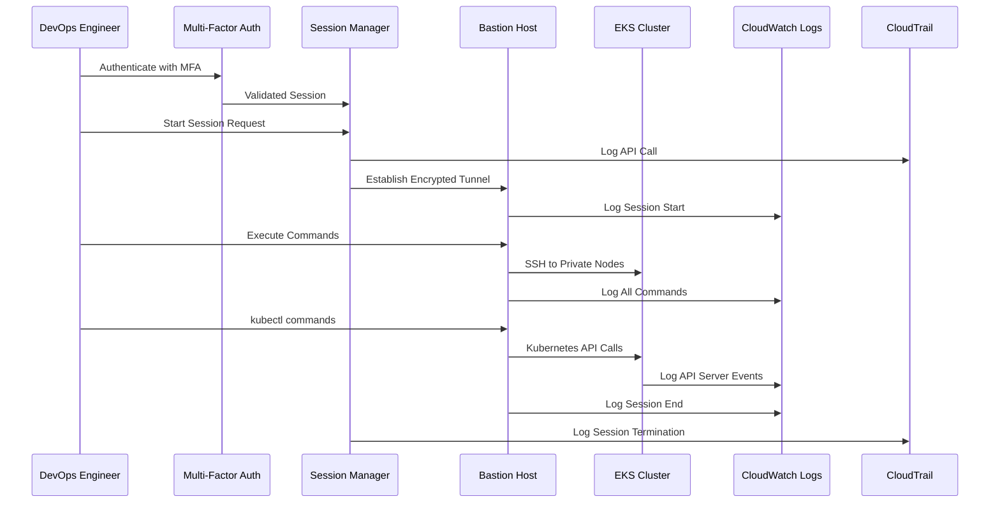
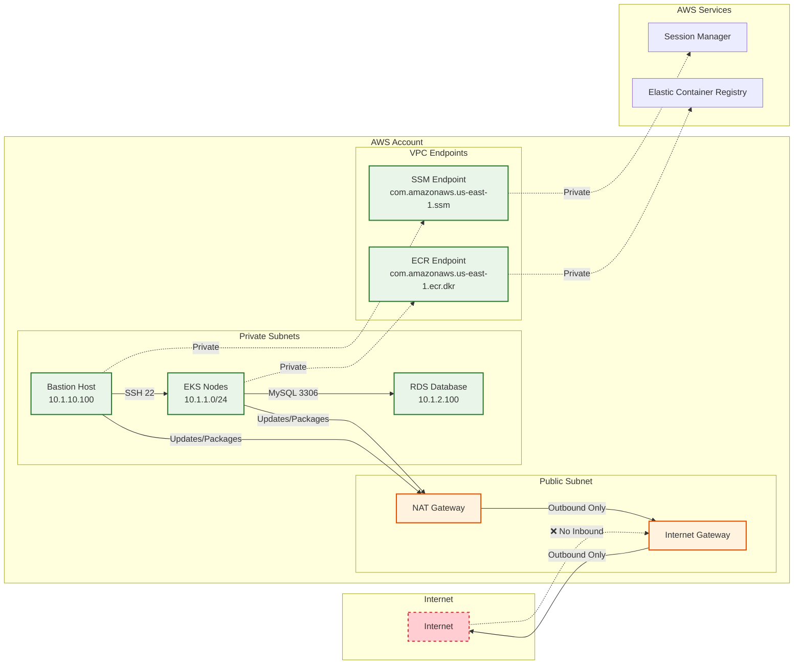
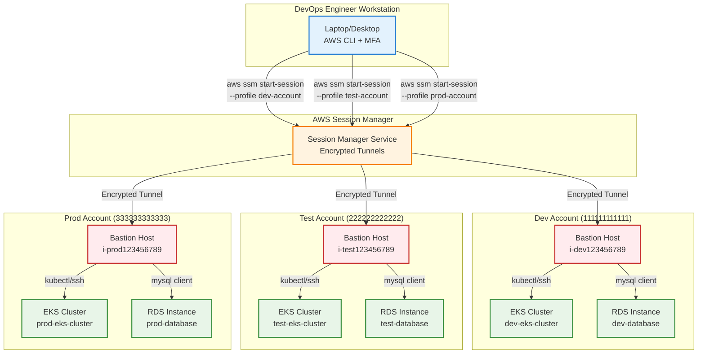
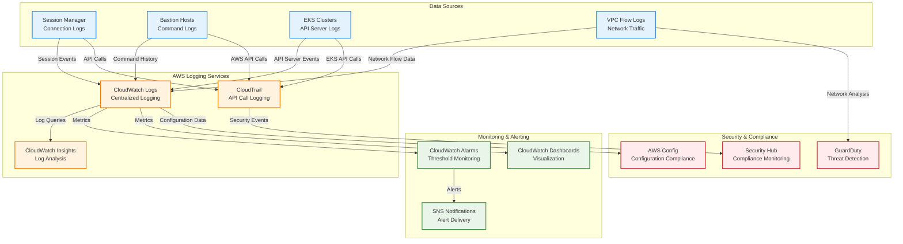
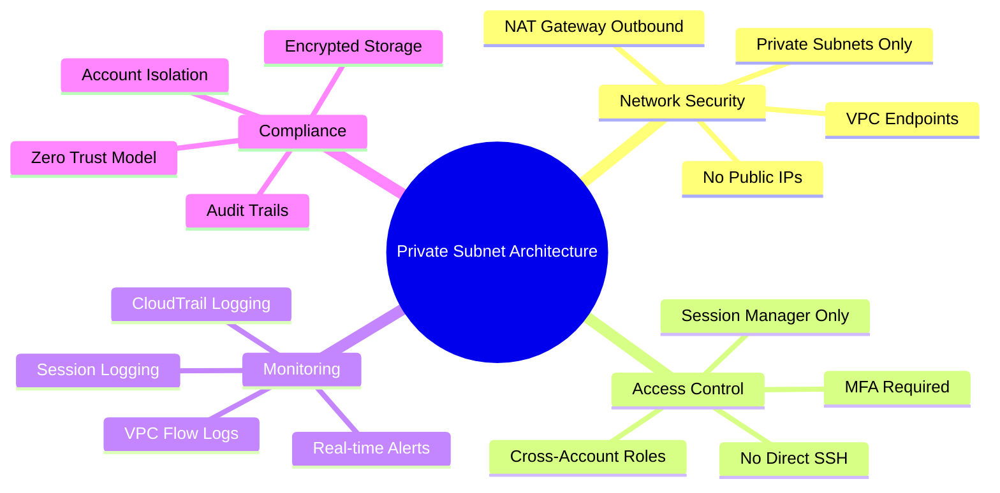

# 🏗️ Private Subnet Multi-Account Architecture Diagram

## 🎯 **Complete Architecture Overview**

```mermaid
graph TB
    subgraph "AWS Organization"
        subgraph "Dev Account (111111111111)"
            subgraph "VPC 10.1.0.0/16"
                subgraph "Public Subnet 10.1.0.0/24"
                    IGW1[Internet Gateway]
                    NAT1[NAT Gateway]
                end
                
                subgraph "Private Subnets"
                    subgraph "Bastion Subnet 10.1.10.0/24"
                        BASTION1[Bastion Host<br/>Session Manager Access]
                    end
                    
                    subgraph "App Subnet 10.1.1.0/24"
                        EKS1[EKS Cluster<br/>Private Nodes]
                        RDS1[RDS Database<br/>Private]
                    end
                    
                    subgraph "Data Subnet 10.1.2.0/24"
                        EC2_1[EC2 Instances<br/>Private]
                    end
                end
                
                subgraph "VPC Endpoints"
                    SSM1[SSM Endpoint]
                    ECR1[ECR Endpoint]
                    S3_1[S3 Endpoint]
                end
            end
        end
        
        subgraph "Test Account (222222222222)"
            subgraph "VPC 10.2.0.0/16"
                subgraph "Public Subnet 10.2.0.0/24"
                    IGW2[Internet Gateway]
                    NAT2[NAT Gateway]
                end
                
                subgraph "Private Subnets"
                    subgraph "Bastion Subnet 10.2.10.0/24"
                        BASTION2[Bastion Host<br/>Session Manager Access]
                    end
                    
                    subgraph "App Subnet 10.2.1.0/24"
                        EKS2[EKS Cluster<br/>Private Nodes]
                        RDS2[RDS Database<br/>Private]
                    end
                    
                    subgraph "Data Subnet 10.2.2.0/24"
                        EC2_2[EC2 Instances<br/>Private]
                    end
                end
                
                subgraph "VPC Endpoints"
                    SSM2[SSM Endpoint]
                    ECR2[ECR Endpoint]
                    S3_2[S3 Endpoint]
                end
            end
        end
        
        subgraph "Prod Account (333333333333)"
            subgraph "VPC 10.3.0.0/16"
                subgraph "Public Subnet 10.3.0.0/24"
                    IGW3[Internet Gateway]
                    NAT3[NAT Gateway]
                end
                
                subgraph "Private Subnets"
                    subgraph "Bastion Subnet 10.3.10.0/24"
                        BASTION3[Bastion Host<br/>Session Manager Access]
                    end
                    
                    subgraph "App Subnet 10.3.1.0/24"
                        EKS3[EKS Cluster<br/>Private Nodes]
                        RDS3[RDS Database<br/>Private]
                    end
                    
                    subgraph "Data Subnet 10.3.2.0/24"
                        EC2_3[EC2 Instances<br/>Private]
                    end
                end
                
                subgraph "VPC Endpoints"
                    SSM3[SSM Endpoint]
                    ECR3[ECR Endpoint]
                    S3_3[S3 Endpoint]
                end
            end
        end
    end
    
    subgraph "External Access"
        USER[DevOps Engineer]
        INTERNET[Internet]
    end
    
    subgraph "AWS Services"
        SESSION_MGR[AWS Session Manager]
        CLOUDTRAIL[CloudTrail Logging]
        CLOUDWATCH[CloudWatch Logs]
    end
    
    %% Access Flow
    USER -->|AWS CLI + MFA| SESSION_MGR
    SESSION_MGR -->|Encrypted Tunnel| BASTION1
    SESSION_MGR -->|Encrypted Tunnel| BASTION2
    SESSION_MGR -->|Encrypted Tunnel| BASTION3
    
    %% Internal Access
    BASTION1 -->|SSH| EKS1
    BASTION1 -->|SSH| EC2_1
    BASTION2 -->|SSH| EKS2
    BASTION2 -->|SSH| EC2_2
    BASTION3 -->|SSH| EKS3
    BASTION3 -->|SSH| EC2_3
    
    %% Internet Access (Outbound Only)
    NAT1 -->|Outbound Only| INTERNET
    NAT2 -->|Outbound Only| INTERNET
    NAT3 -->|Outbound Only| INTERNET
    
    %% Logging
    BASTION1 -->|Session Logs| CLOUDWATCH
    BASTION2 -->|Session Logs| CLOUDWATCH
    BASTION3 -->|Session Logs| CLOUDWATCH
    
    %% API Logging
    SESSION_MGR -->|API Calls| CLOUDTRAIL
    
    %% Styling
    classDef accountBox fill:#e1f5fe,stroke:#01579b,stroke-width:2px
    classDef privateSubnet fill:#f3e5f5,stroke:#4a148c,stroke-width:2px
    classDef publicSubnet fill:#fff3e0,stroke:#e65100,stroke-width:2px
    classDef bastion fill:#ffebee,stroke:#c62828,stroke-width:2px
    classDef endpoint fill:#e8f5e8,stroke:#2e7d32,stroke-width:2px
    
    class BASTION1,BASTION2,BASTION3 bastion
    class SSM1,SSM2,SSM3,ECR1,ECR2,ECR3,S3_1,S3_2,S3_3 endpoint
```

## 🔐 **Security Flow Diagram**

## 🌐 **Network Flow Diagram**

## 🔧 **Access Pattern Diagram**

## 📊 **Monitoring & Logging Flow**

## 🎯 **Key Architecture Benefits**

### ✅ **Security Benefits Visualization**

This comprehensive diagram set shows:

1. **🏗️ Complete Architecture** - Multi-account layout with all components
2. **🔐 Security Flow** - Step-by-step access authentication and logging
3. **🌐 Network Flow** - Traffic patterns and connectivity rules
4. **🔧 Access Patterns** - How engineers access different environments
5. **📊 Monitoring Flow** - Logging and alerting architecture
6. **🎯 Benefits Mind Map** - Key advantages of the architecture

The diagrams clearly illustrate the zero-trust, private subnet approach with complete isolation and comprehensive monitoring across all three AWS accounts.