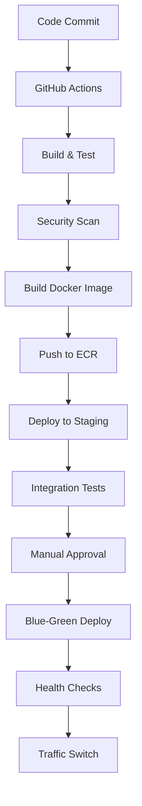

# Private Subnet Multi-Account Architecture

## Overview
This document outlines the architecture for deploying enterprise infrastructure across multiple AWS accounts using private subnets, Session Manager access, and zero-trust security principles with complete network isolation.

## 1. Multi-Account Architecture

### Private Subnet Strategy
```
┌─────────────────────────────────────────────────────────────┐
│                    AWS Organization                           │
├─────────────────────────────────────────────────────────────┤
│  Dev (111111111111)    Test (222222222222)    Prod (333333333333)  │
│  ┌─────────────┐    ┌─────────────┐    ┌─────────────┐         │
│  │ Private VPC   │    │ Private VPC   │    │ Private VPC   │         │
│  │ 10.1.0.0/16   │    │ 10.2.0.0/16   │    │ 10.3.0.0/16   │         │
│  │ Session Mgr   │    │ Session Mgr   │    │ Session Mgr   │         │
│  │ Bastion Host  │    │ Bastion Host  │    │ Bastion Host  │         │
│  └─────────────┘    └─────────────┘    └─────────────┘         │
└─────────────────────────────────────────────────────────────┘
```

### Infrastructure Components
- **Private VPCs**: Isolated networks per AWS account with no public access
- **Session Manager**: Secure access without SSH keys or public connectivity
- **Bastion Hosts**: Controlled access points with comprehensive audit logging
- **VPC Endpoints**: Private connectivity to AWS services (SSM, ECR, S3)
- **NAT Gateways**: Outbound internet access for updates and package downloads
- **CloudTrail**: Complete API call logging across all accounts

### Scaling Strategy
- **Horizontal Pod Autoscaler (HPA)**: CPU/memory-based scaling
- **Vertical Pod Autoscaler (VPA)**: Right-sizing containers
- **Cluster Autoscaler**: Node-level scaling based on demand
- **Custom Metrics**: Business logic-based scaling via Prometheus

## 2. Container Strategy

### Containerization Approach
- **Multi-stage Docker builds**: Minimize image size and attack surface
- **Distroless base images**: Enhanced security with minimal dependencies
- **Non-root execution**: Security hardening
- **Health checks**: Kubernetes-native liveness/readiness probes

### Configuration Management
```yaml
# Per-client configuration hierarchy
configs/
├── base/                 # Common configurations
├── overlays/
│   ├── client-a/        # Client-specific overrides
│   ├── client-b/
│   └── staging/         # Environment-specific
```

### Secrets Management
- **AWS Secrets Manager**: Centralized secret storage
- **External Secrets Operator**: Kubernetes integration
- **Sealed Secrets**: GitOps-friendly encrypted secrets
- **Pod Identity**: IAM roles for service accounts (IRSA)

## 3. Failure Scenarios & Recovery

### Scenario 1: Pod Failures
- **Detection**: Kubernetes liveness probes, Prometheus alerts
- **Mitigation**: Automatic pod restart, circuit breakers
- **Prevention**: Resource limits, proper health checks

### Scenario 2: Node Failures
- **Detection**: Node status monitoring, cluster autoscaler events
- **Mitigation**: Pod rescheduling, cluster autoscaler replacement
- **Prevention**: Multi-AZ deployment, node health monitoring

### Scenario 3: Database Connection Loss
- **Detection**: Connection pool metrics, application health checks
- **Mitigation**: Connection retry logic, circuit breakers
- **Prevention**: RDS Multi-AZ, connection pooling

### Scenario 4: Network Partitioning
- **Detection**: Istio service mesh metrics, network monitoring
- **Mitigation**: Retry policies, timeout configurations
- **Prevention**: Multi-AZ deployment, network redundancy

### Scenario 5: Resource Exhaustion
- **Detection**: Resource utilization alerts, OOMKilled events
- **Mitigation**: Horizontal scaling, resource quotas
- **Prevention**: Proper resource requests/limits, monitoring

## 4. Monitoring Strategy

### Metrics Collection
```yaml
Application Metrics:
  - Request rate, latency, error rate (RED metrics)
  - Business metrics: jobs processed, data volume
  - Custom metrics: queue depth, processing time

Infrastructure Metrics:
  - CPU, memory, disk, network utilization
  - Kubernetes metrics: pod status, resource usage
  - AWS metrics: RDS performance, ELB health

Service Mesh Metrics:
  - Service-to-service communication
  - Traffic patterns and security policies
  - Distributed tracing data
```

### Health Check Implementation
- **Kubernetes Probes**: Liveness, readiness, startup
- **Application Health**: `/health` endpoint with dependency checks
- **Deep Health Checks**: Database connectivity, external service availability

### Alerting Configuration
```yaml
Critical Alerts:
  - Service down (>5min)
  - High error rate (>5%)
  - Database connection failures
  - Resource exhaustion

Warning Alerts:
  - High latency (>2s p95)
  - Scaling events
  - Certificate expiration (30 days)
```

## 5. Technology Stack

### Core Infrastructure
- **Terraform**: AWS infrastructure provisioning
- **AWS EKS**: Kubernetes cluster management
- **Istio**: Service mesh for traffic management
- **Helm**: Application deployment and management

### Monitoring & Observability
- **Prometheus**: Metrics collection and alerting
- **Grafana**: Visualization and dashboards
- **Jaeger**: Distributed tracing
- **ELK Stack**: Elasticsearch, Logstash, Kibana for centralized logging
- **Filebeat**: Log collection from containers

### Security & Compliance
- **AWS IAM**: Identity and access management
- **Istio Security**: mTLS, authorization policies
- **Falco**: Runtime security monitoring
- **OPA Gatekeeper**: Policy enforcement

## 6. Deployment Flow



This architecture ensures high availability, scalability, and security while providing comprehensive monitoring and observability across all client environments.