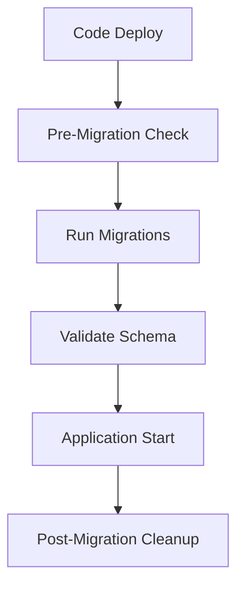

# Deployment Strategy

## Versioning and Tagging Strategy

### Semantic Versioning
We follow semantic versioning (SemVer) for all releases:
- **MAJOR.MINOR.PATCH** (e.g., 1.2.3)
- **MAJOR**: Breaking changes
- **MINOR**: New features (backward compatible)
- **PATCH**: Bug fixes (backward compatible)

### Git Tagging Strategy
```bash
# Release tags
v1.0.0, v1.1.0, v1.1.1

# Pre-release tags
v1.2.0-alpha.1, v1.2.0-beta.1, v1.2.0-rc.1

# Branch-based tags
main-abc123f, develop-def456a
```

### Docker Image Tagging
```yaml
# Production tags
registry.company.com/data-collection:v1.0.0
registry.company.com/data-collection:latest

# Environment-specific tags
registry.company.com/data-collection:staging-abc123f
registry.company.com/data-collection:develop-def456a

# SHA-based tags for traceability
registry.company.com/data-collection:sha-abc123f456
```

## Database Migration Strategy

### Migration Approach
1. **Forward-Only Migrations**: All migrations are additive
2. **Backward Compatibility**: Maintain compatibility during rollouts
3. **Zero-Downtime**: Use blue-green deployments for schema changes

### Migration Process


### Implementation
```yaml
# Kubernetes Job for migrations
apiVersion: batch/v1
kind: Job
metadata:
  name: db-migration-v1-2-0
spec:
  template:
    spec:
      containers:
      - name: migration
        image: data-collection:v1.2.0
        command: ["python", "manage.py", "migrate"]
      restartPolicy: Never
```

## Rollback Process

### Automated Rollback Triggers
- Health check failures (>3 consecutive failures)
- Error rate > 5% for 2 minutes
- Manual trigger via deployment dashboard

### Rollback Procedure
```bash
# Helm rollback
helm rollback data-collection-service 1 --namespace data-collection

# Kubernetes rollback
kubectl rollout undo deployment/data-collection-service -n data-collection

# Database rollback (if needed)
kubectl apply -f migrations/rollback-v1.1.0.yaml
```

### Rollback Validation
1. Health check verification
2. Smoke test execution
3. Metrics validation
4. User acceptance testing

## Multi-Client Environment Implementation

### Environment Isolation Strategy
```
Client A Environment:
├── AWS Account: 111111111111
├── EKS Cluster: client-a-prod
├── Namespace: data-collection-client-a
└── Database: client-a-db

Client B Environment:
├── AWS Account: 222222222222
├── EKS Cluster: client-b-prod
├── Namespace: data-collection-client-b
└── Database: client-b-db
```

### Terraform Workspace Management
```bash
# Create client-specific workspaces
terraform workspace new client-a-prod
terraform workspace new client-b-prod

# Deploy infrastructure per client
terraform apply -var-file="clients/client-a/prod.tfvars"
terraform apply -var-file="clients/client-b/prod.tfvars"
```

### Helm Chart Customization
```yaml
# values-client-a.yaml
environment: client-a
resources:
  limits:
    cpu: 2000m
    memory: 4Gi
autoscaling:
  maxReplicas: 50

# values-client-b.yaml
environment: client-b
resources:
  limits:
    cpu: 1000m
    memory: 2Gi
autoscaling:
  maxReplicas: 20
```

## Deployment Patterns

### Blue-Green Deployment
```yaml
# Blue environment (current)
apiVersion: apps/v1
kind: Deployment
metadata:
  name: data-collection-blue
spec:
  replicas: 3
  selector:
    matchLabels:
      app: data-collection
      version: blue

# Green environment (new)
apiVersion: apps/v1
kind: Deployment
metadata:
  name: data-collection-green
spec:
  replicas: 3
  selector:
    matchLabels:
      app: data-collection
      version: green
```

### Canary Deployment with Istio
```yaml
apiVersion: networking.istio.io/v1beta1
kind: VirtualService
metadata:
  name: data-collection-canary
spec:
  http:
  - match:
    - headers:
        canary:
          exact: "true"
    route:
    - destination:
        host: data-collection
        subset: v2
  - route:
    - destination:
        host: data-collection
        subset: v1
      weight: 90
    - destination:
        host: data-collection
        subset: v2
      weight: 10
```

## 20+ Client Environment Management

### GitOps Approach
```
environments/
├── client-001/
│   ├── dev/
│   ├── staging/
│   └── prod/
├── client-002/
│   ├── dev/
│   ├── staging/
│   └── prod/
└── shared/
    ├── monitoring/
    └── security/
```

### Automated Deployment Pipeline
```yaml
# GitHub Actions matrix strategy
strategy:
  matrix:
    client: [client-001, client-002, ..., client-020]
    environment: [dev, staging, prod]
steps:
  - name: Deploy to ${{ matrix.client }}-${{ matrix.environment }}
    run: |
      helm upgrade --install data-collection-service \
        --namespace ${{ matrix.client }}-${{ matrix.environment }} \
        --values environments/${{ matrix.client }}/${{ matrix.environment }}/values.yaml
```

### Monitoring and Alerting
```yaml
# Prometheus federation for multi-client monitoring
- job_name: 'federate-clients'
  scrape_interval: 15s
  honor_labels: true
  metrics_path: '/federate'
  params:
    'match[]':
      - '{job=~"data-collection-.*"}'
  static_configs:
    - targets:
      - 'client-a-prometheus:9090'
      - 'client-b-prometheus:9090'
```

### Configuration Management
```yaml
# ArgoCD ApplicationSet for multi-client deployment
apiVersion: argoproj.io/v1alpha1
kind: ApplicationSet
metadata:
  name: data-collection-clients
spec:
  generators:
  - clusters: {}
  template:
    metadata:
      name: '{{name}}-data-collection'
    spec:
      project: default
      source:
        repoURL: https://github.com/company/data-collection-service
        targetRevision: HEAD
        path: helm/data-collection-service
        helm:
          valueFiles:
          - values-{{name}}.yaml
      destination:
        server: '{{server}}'
        namespace: data-collection
```

## Deployment Metrics and KPIs

### Key Metrics
- **Deployment Frequency**: Target 10+ deployments/day
- **Lead Time**: Code commit to production < 2 hours
- **MTTR**: Mean time to recovery < 15 minutes
- **Change Failure Rate**: < 5%

### Monitoring Dashboard
- Deployment success/failure rates
- Rollback frequency and reasons
- Environment health status
- Client-specific performance metrics

This deployment strategy ensures reliable, scalable, and maintainable deployments across multiple client environments while maintaining high availability and quick recovery capabilities.